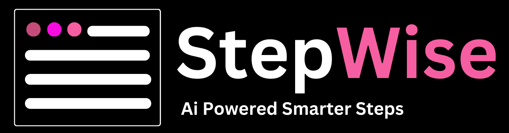

# StepWise 

## 🏆 Best Digital Automation Project – WinHacks 2025  

StepWise was awarded **Best Digital Automation Project** at **WinHacks 2025**, recognized for its intelligent task management and seamless workflow automation.  

🔗 **Check it out on Devpost:** [StepWise on Devpost](https://devpost.com/software/stepwise)  

**Note:** This project was done in collaboration with [Jalees Bajwa](https://github.com/jaleesbajwa55) at WinHacks Hackathon, [Repository](https://github.com/jaleesbajwa55/StepWise) was used for coding from same workingspace. This is a refined repository for archiving the project and presenting it.

### Built With 🔧  

         

An intelligent scheduling web application that integrates Google Calendar and utilizes the Gemini API to break down projects efficiently.

## 🎥 Demo Video
[Watch the video](https://youtu.be/1o1mRxkQ1lo)

## 🌟 Features
- Google Calendar integration
- AI-powered project breakdown using Gemini API
- React-based frontend
- Python backend
- User authentication and dashboard

## 🛠️ Setup Instructions

### Prerequisites
- Node.js & npm
- Python 3.x
- Google Cloud API credentials

### Installation
```bash
# Clone the repository
git clone https://github.com/yourusername/touring-company.git
cd touring-company

# Install frontend dependencies
cd frontend
npm install

# Install backend dependencies
cd ../backend
pip install -r requirements.txt
```

### Environment Variables
Create a `.env` file in both `frontend` and `backend` directories with the required API keys.

### Running the Application
```bash
# Start the backend
cd backend
python app.py

# Start the frontend
cd ../frontend
npm start
```

## 📡 API Endpoints
| Endpoint       | Method | Description                        |
|--------------|--------|--------------------------------|
| `/schedule`   | POST   | AI-based project breakdown |
| `/events`     | GET    | Fetch calendar events       |

## 🚀 Deployment
To deploy the application, use Docker or cloud services like Vercel, AWS, or Firebase.

### Using Docker
```bash
docker-compose up --build
```

### Deploying Frontend (Vercel)
```bash
vercel --prod
```

### Deploying Backend (Heroku)
```bash
git push heroku main
```

---

### 📩 Contact
For inquiries, reach out to `hz.hassanzafar@gmail.com`.

### Credits
[Jalees Bajwa](https://github.com/jaleesbajwa55)
